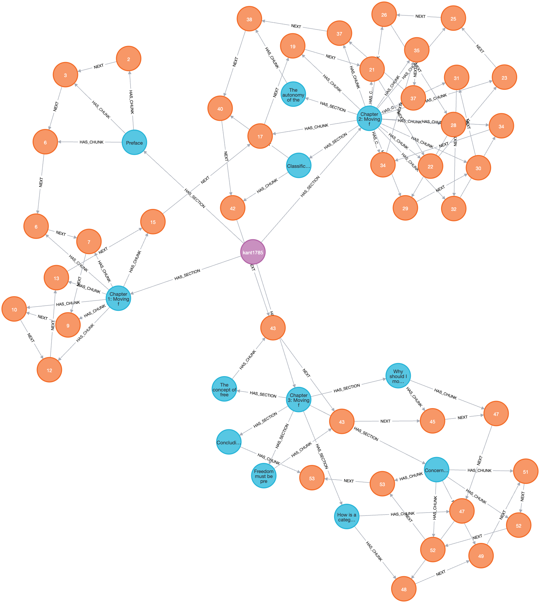

# xdoc-qa

**Generating questions that can only be answered by reading several documents together.**

Most QA datasets ask about one passage of one document. Real questions often need more:
*"How would Kant and Mill judge a lie told to save a friend?"* has no single source.
This project builds such cross-document questions automatically from long PDFs.

> Work in progress: this README grows one step at a time.

## The corpus

Four classics of moral philosophy, each answering *what makes an action good?* differently:

| Document | Author | Answer in one word |
|---|---|---|
| An Enquiry Concerning the Principles of Morals | Hume | sentiment |
| Groundwork of the Metaphysics of Morals | Kant | duty |
| Utilitarianism | J. S. Mill | consequences |
| On the Genealogy of Morality | Nietzsche | critique of morality itself |

Hume and Kant answer each other directly, Mill builds on both, Nietzsche attacks all of them.

Same topics, different positions, different words for the same idea
(*happiness*, *utility*, *pleasure*, *well-being*): a natural testbed for cross-document questions.

## Methodology

### 1. PDF conversion

**Goal:** get reliable text out of any PDF, page by page.

A PDF page is either **written text** (you can select it with the mouse) or a **photo of a page**
(a scan: for the computer it is just an image). Many PDFs mix both, and old scans often carry
a hidden, low-quality text layer. Every later step is built on this text, so it has to be right.

**How it works.** For every page:

1. **Read** the text already in the page, if any.
2. **Score** it: the share of words that are real words of the language (via `wordfreq`).
3. **Decide**:
   - good text → keep the page as it is;
   - no text and the page is one big image → it is a scan → **OCR**;
   - text with a low score → **OCR**, but keep the original if OCR does not score better.
4. **Rebuild** OCR pages as *page image + invisible text*: they look the same, but their text is now readable.
5. **Re-read and re-score** everything, and write a report.

**Tools:** `PyMuPDF` to read, render and write PDFs; `RapidOCR` (PaddleOCR models) for OCR.
Both install with `pip` alone, no system dependencies.

**Output:** for each document, a converted PDF with the same pages, and one line per page with
its text, its origin (`native` / `ocr`) and its score.

**Design choices**

- *Decide per page, not per document*: real PDFs are often mixed.
- *Deterministic OCR, not an LLM*: a vision LLM may silently "fix" or invent words;
  answers must be grounded in the exact text, so a visible error beats an invisible one.
- *Never make a page worse*: if OCR does not beat the existing text, the original is kept.

**Results**

| Document | Pages | Kept as is | OCR | Low score, original kept | Mean score |
|---|---|---|---|---|---|
| Hume | 74 | 74 | – | – | 0.99 |
| Nietzsche | 229 | 228 | 1 | – | 0.99 |
| Mill | 121 | 120 | 1 (scanned page) | – | 1.00 |
| Kant | 53 | 53 | – | – | 1.00 |

All four PDFs are born-digital: OCR was almost never needed, and the pipeline recognised it on its own.

**Known limitation:** the score measures how *English* a page is, not how *correct* it is.
A page of Nietzsche quoting Tertullian in Latin scores 0.78 while being perfectly fine, so it is sent
to OCR and stays flagged as low quality in the report. To limit the damage, OCR replaces existing text
only if it scores clearly better (+0.05).

### 2. Document structure

**Goal:** split each book along the author's own structure (books, chapters, sections)
instead of cutting it every N words, so that every piece is a complete unit of meaning.

**How it works.** [PageIndex](https://github.com/VectifyAI/PageIndex) builds the table of
contents of each PDF as a tree: every section has a title, a first and last page, a short
LLM summary and its sub-sections. The smallest sections (the *leaves*) will become our chunks.
Documents are processed one at a time.

1. **Flash mode first:** the tree is built from the PDF bookmarks and the page layout
   (font sizes, bold, numbering), with no LLM; then the LLM writes the summaries.
2. **Standard mode as fallback:** if flash finds no real structure, the LLM reads the
   pages and reconstructs the headings.
3. **Summary check:** small models sometimes answer in JSON, cut the answer half-way or refuse.
   Every summary is cleaned into plain text; unusable ones are redone once, for that section only.

**LLM:** the model is set in `.env` (`LLM_MODEL`), never in the code. Two options:

- **Local (default):** an open-source model (Gemma 3) running with [Ollama](https://ollama.com):
  no API key, no cost, nothing leaves the machine.
- **Cloud:** any provider supported by [LiteLLM](https://docs.litellm.ai/docs/providers)
  (Gemini, OpenAI, Anthropic…): set `LLM_MODEL` and the provider's API key in `.env`.

**Design choices**

- *Keep the author's structure untouched*: PageIndex can merge and split sections to optimise
  its own search; we switch that off and size the chunks ourselves in the next step, with measured criteria.
- *Limited parallelism*: `LLM_CONCURRENCY` in `.env` caps simultaneous LLM calls
  (low for a local model, higher for a cloud one).
- *Built once, cached*: trees are saved and reused.

### 3. Cleaning and semantic chunking

**Goal:** turn the trees into the final pieces of text (*chunks*) that will become the nodes of the graph.

PageIndex's leaves are the natural chunks: each is a section the author wrote as a unit.
Two things still have to be handled.

**Cleaning the tree**

- *Only the author's text.* Editors' introductions, chronologies, bibliographies and indexes are left out.
  The pages of the author's text (and any section to skip, e.g. Mill's endnotes) are set by hand in
  `corpus.yaml` (a few lines, visible to everyone):
  an automatic guess proved unreliable, e.g. a summariser attributing a bibliography to Nietzsche.
- *Only the body text.* Footnotes (printed smaller than the main text), running heads repeated at the top of
  most pages and page numbers are dropped: otherwise "47 P. Mérimée, Lettres à une inconnue…" would end up
  in the middle of Nietzsche's argument, and look to the chunker like a change of topic.
- *No text twice, no text lost.* Each section starts exactly where its title appears in the text, not at the
  start of its page, so two sections never share a page. Duplicated nodes are merged, and the text a chapter
  has before its first sub-section becomes a piece of its own (in Kant, 22 pages of Chapter 2 were in no leaf).

**Semantic chunking: splitting only where the topic changes**

Some leaves are very long (Mill's Chapter V: 42 pages; Nietzsche's Third Essay: 53) because the books have no
finer headings. One embedding for 50 pages is a blurred average of many ideas. Instead of cutting every N pages,
we cut where the *meaning* changes:

1. the section is split into sentences; each sentence, together with its neighbours, gets an embedding;
2. we measure how much the meaning changes from one sentence to the next;
3. we cut at the biggest changes: those in the top 5% of the **whole corpus**.
   A section about a single topic has no such change and stays whole, however long it is.

Two limits: no chunk shorter than ~half a page (too little context), none longer than the embedding model can read.
Chunks keep their place in the tree ("Third essay, part 3 of 12") and their page numbers, for citations.

**The one parameter** is the percentile (95): lower means more cuts and smaller chunks. Its effect is reported below.

### 4. The graph

**Goal:** put the whole corpus in one graph, so that documents, their structure and their text can be
explored together, and graph algorithms can run on it.

Each document becomes a small tree inside [Neo4j](https://neo4j.com):

```
(Document: Kant) -[:HAS_SECTION]-> (Section: Chapter 2) -[:HAS_SECTION]-> (Section: The autonomy of the will)
                                                                     -[:HAS_CHUNK]-> (Chunk: kant-0031)
(Chunk: kant-0030) -[:NEXT]-> (Chunk: kant-0031)          reading order
```

- **Document**: author and title.
- **Section**: a node of the PageIndex tree, with its pages and its summary.
- **Chunk**: a piece of text from step 3, with its pages (for citations).

At this point the four documents are four separate trees: nothing links Kant to Mill yet.
The links between documents come in the next step, from the meaning of the chunks.



*Kant's Groundwork in Neo4j: the document (purple), its chapters and sections (blue), the chunks (orange),
linked in reading order by `NEXT`.*

**Exploring the graph.** Open http://localhost:7474 and try these queries (Cypher, Neo4j's query language):

```cypher
// 1. What is in the database
MATCH (n) RETURN labels(n)[0] AS type, count(*) AS how_many

// 2. The picture above: one book as a tree
MATCH p = (:Document {author: "Kant"})-[:HAS_SECTION*]->(:Section)-[:HAS_CHUNK]->(:Chunk)
RETURN p

// 3. The table of contents of a book, with pages
MATCH (:Document {author: "Mill"})-[:HAS_SECTION*]->(s:Section)
RETURN s.depth, s.title, s.start_page, s.end_page ORDER BY s.start_page

// 4. Read a section, chunk by chunk
MATCH (s:Section)-[:HAS_CHUNK]->(c:Chunk)
WHERE s.title STARTS WITH "How is a categorical imperative possible"
RETURN c.id, c.start_page, c.text ORDER BY c.id

// 5. Where does a chunk come from? (book > chapter > section)
MATCH p = (d:Document)-[:HAS_SECTION*]->(:Section)-[:HAS_CHUNK]->(:Chunk {id: "kant-0031"})
RETURN [x IN nodes(p) | coalesce(x.title, x.name)] AS breadcrumb

// 6. Keep reading: the next three chunks
MATCH p = (:Chunk {id: "kant-0031"})-[:NEXT*1..3]->(:Chunk)
RETURN p

// 7. A first hint of cross-document questions: who talks about happiness, and how much?
MATCH (c:Chunk) WHERE toLower(c.text) CONTAINS "happiness"
RETURN c.author, count(*) AS chunks ORDER BY chunks DESC
```

Query 7 finds words, not ideas: Hume's *utility*, Mill's *pleasure* and Kant's *inclination* are missed.
Linking chunks by meaning is the job of the next step.

## Getting started

### Requirements

- **Python 3.11+**
- **Docker**, any runtime that provides the `docker` command
  (Docker Desktop, Rancher Desktop, Colima…): it runs the graph database.
- **An LLM**, either
  - local: [Ollama](https://ollama.com) with the model pulled (`ollama pull gemma3:4b`), or
  - cloud: an API key of any LiteLLM provider, e.g. Gemini.

### 1. Python environment

```bash
python -m venv .venv
source .venv/bin/activate
pip install -e .
cp .env.example .env     # then edit it: LLM_MODEL (+ API key if cloud), NEO4J_PASSWORD
```

### 2. Graph database: Neo4j + Graph Data Science

[Neo4j](https://neo4j.com) stores the documents as a graph (sections, chapters, similarity links);
its [Graph Data Science](https://neo4j.com/docs/graph-data-science/current/) plugin runs the
graph algorithms (community detection) inside the database. Both run in Docker:

```bash
docker compose up -d     # first start: downloads Neo4j and the GDS plugin
```

Then open **http://localhost:7474** (user `neo4j`, password from `.env`) and check that GDS is loaded:

```cypher
RETURN gds.version()
```

The data lives in `data/neo4j/` and survives restarts (`docker compose down` / `up -d`).

### 3. Local LLM (only if you use Ollama)

Some steps send many pages at once to the model, so give Ollama a longer context than its default:

```bash
ollama pull gemma3:4b
ollama pull nomic-embed-text
OLLAMA_CONTEXT_LENGTH=32768 ollama serve
```

### 4. Your documents

Put your PDFs in `data/raw/` (not committed to git) and describe them in `corpus.yaml`:
for each file, the author, the title and the pages that contain the author's own text.
`corpus.yaml` can be written by hand or drafted by an LLM from the trees of step 2.

### 5. Run the pipeline

```bash
# put the PDFs in data/raw/, then
python -m xdocqa.pdf_conversion   # step 1: PDF conversion
python -m xdocqa.structure        # step 2: document structure
python -m xdocqa.chunking         # step 3: cleaning and semantic chunking
python -m xdocqa.graph            # step 4: load the graph into Neo4j
```