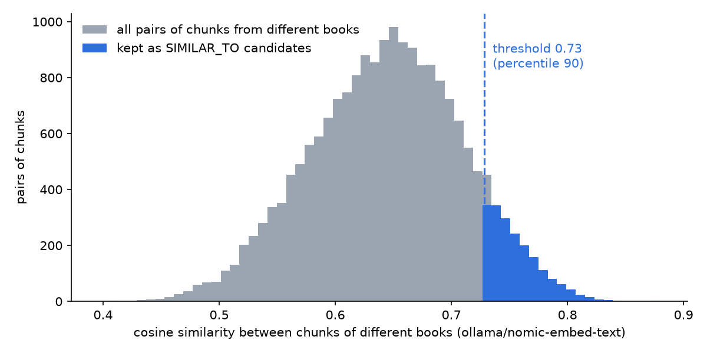
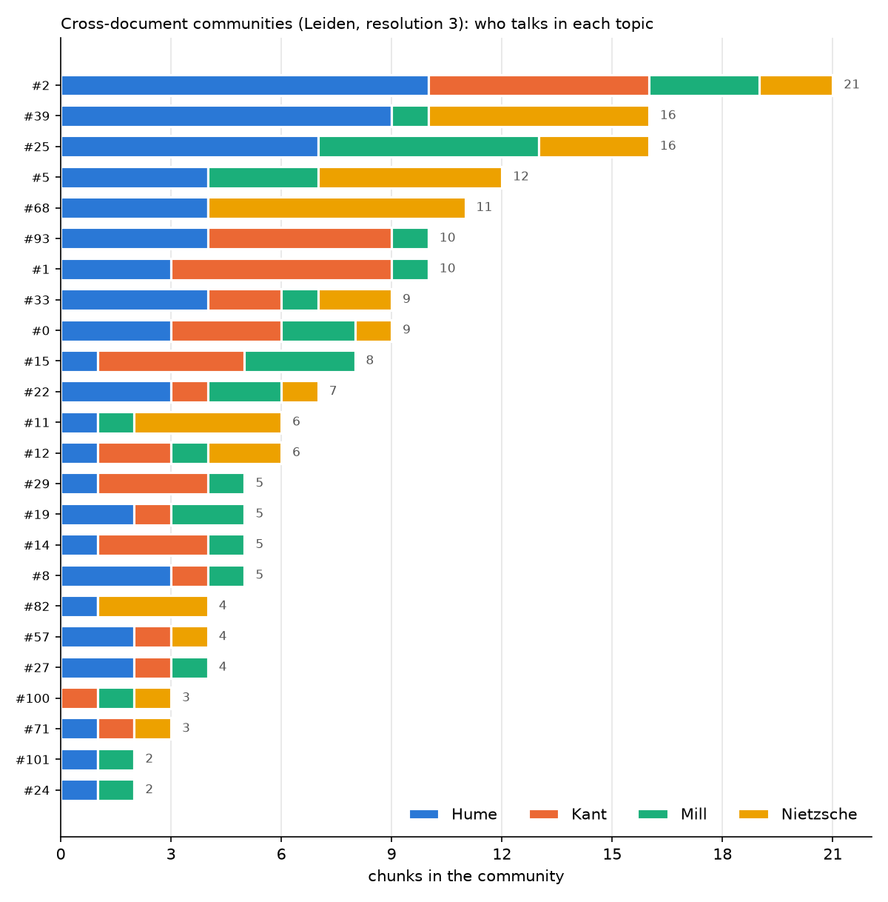

# xdoc-qa

**Generating questions that can only be answered by reading several documents together.**

Most QA datasets ask about one passage of one document. Real questions often need more:
*"How would Kant and Mill judge a lie told to save a friend?"* has no single source.
This project builds such cross-document questions automatically from long PDFs.

```
PDF → text (OCR if needed) → structure tree → clean semantic chunks → Neo4j graph
    → cross-book similarity links → Leiden communities (shared topics)
    → one question per pair of authors → LLM judge → final questions
```

**Results at a glance** (4 books, everything local: Ollama + Neo4j):

| | |
|---:|---|
| 232 | clean chunks from 4 books |
| 24 | topics shared by at least two books (Leiden communities) |
| 62 | cross-document questions generated, covering all 6 pairs of authors |

Every answer cites its pages, and an LLM judge keeps only the answers whose claims are all supported by
a sentence quoted from the sources.

## The corpus

Four classics of moral philosophy, each answering *what makes an action good?* differently:

| Document | Author | Answer in one word |
|---|---|---|
| An Enquiry Concerning the Principles of Morals | Hume | sentiment |
| Groundwork of the Metaphysics of Morals | Kant | duty |
| Utilitarianism | J. S. Mill | consequences |
| On the Genealogy of Morality | Nietzsche | critique of morality itself |

Hume and Kant answer each other directly, Mill builds on both, Nietzsche attacks all of them.

Same topics, different positions, different words for the same idea
(*happiness*, *utility*, *pleasure*, *well-being*): a natural testbed for cross-document questions.

## Methodology

### 1. PDF conversion

**Goal:** get reliable text out of any PDF, page by page.

A PDF page is either **written text** (you can select it with the mouse) or a **photo of a page**
(a scan: for the computer it is just an image). Many PDFs mix both, and old scans often carry
a hidden, low-quality text layer. Every later step is built on this text, so it has to be right.

**How it works.** For every page:

1. **Read** the text already in the page, if any.
2. **Score** it: the share of words that are real words of the language (via `wordfreq`).
3. **Decide**:
   - good text → keep the page as it is;
   - no text and the page is one big image → it is a scan → **OCR**;
   - text with a low score → **OCR**, but keep the original if OCR does not score better.
4. **Rebuild** OCR pages as *page image + invisible text*: they look the same, but their text is now readable.
5. **Re-read and re-score** everything, and write a report.

**Tools:** `PyMuPDF` to read, render and write PDFs; `RapidOCR` (PaddleOCR models) for OCR.
Both install with `pip` alone, no system dependencies.

**Output:** for each document, a converted PDF with the same pages, and one line per page with
its text, its origin (`native` / `ocr`) and its score.

**Design choices**

- *Decide per page, not per document*: real PDFs are often mixed.
- *Deterministic OCR, not an LLM*: a vision LLM may silently "fix" or invent words;
  answers must be grounded in the exact text, so a visible error beats an invisible one.
- *Never make a page worse*: if OCR does not beat the existing text, the original is kept.

**Results**

| Document | Pages | Kept as is | OCR | Low score, original kept | Mean score |
|---|---|---|---|---|---|
| Hume | 74 | 74 | – | – | 0.99 |
| Nietzsche | 229 | 228 | 1 | – | 0.99 |
| Mill | 121 | 120 | 1 (scanned page) | – | 1.00 |
| Kant | 53 | 53 | – | – | 1.00 |

All four PDFs are born-digital: OCR was almost never needed, and the pipeline recognised it on its own.

**Known limitation:** the score measures how *English* a page is, not how *correct* it is.
A page of Nietzsche quoting Tertullian in Latin scores 0.78 while being perfectly fine, so it is sent
to OCR and stays flagged as low quality in the report. To limit the damage, OCR replaces existing text
only if it scores clearly better (+0.05).

### 2. Document structure

**Goal:** split each book along the author's own structure (books, chapters, sections)
instead of cutting it every N words, so that every piece is a complete unit of meaning.

**How it works.** [PageIndex](https://github.com/VectifyAI/PageIndex) builds the table of
contents of each PDF as a tree: every section has a title, a first and last page, a short
LLM summary and its sub-sections. The smallest sections (the *leaves*) will become our chunks.
Documents are processed one at a time.

1. **Flash mode first:** the tree is built from the PDF bookmarks and the page layout
   (font sizes, bold, numbering), with no LLM; then the LLM writes the summaries.
2. **Standard mode as fallback:** if flash finds no real structure, the LLM reads the
   pages and reconstructs the headings.
3. **Summary check:** small models sometimes answer in JSON, cut the answer half-way or refuse.
   Every summary is cleaned into plain text; unusable ones are redone once, for that section only.

**LLM:** the model is set in `.env` (`LLM_MODEL`), never in the code. Two options:

- **Local (default):** an open-source model (Gemma 3) running with [Ollama](https://ollama.com):
  no API key, no cost, nothing leaves the machine.
- **Cloud:** any provider supported by [LiteLLM](https://docs.litellm.ai/docs/providers)
  (Gemini, OpenAI, Anthropic…): set `LLM_MODEL` and the provider's API key in `.env`.

**Design choices**

- *Keep the author's structure untouched*: PageIndex can merge and split sections to optimise
  its own search; we switch that off and size the chunks ourselves in the next step, with measured criteria.
- *Limited parallelism*: `LLM_CONCURRENCY` in `.env` caps simultaneous LLM calls
  (low for a local model, higher for a cloud one).
- *Built once, cached*: trees are saved and reused.

### 3. Cleaning and semantic chunking

**Goal:** turn the trees into the final pieces of text (*chunks*) that will become the nodes of the graph.

PageIndex's leaves are the natural chunks: each is a section the author wrote as a unit.
Two things still have to be handled.

**Cleaning the tree**

- *Only the author's text.* Editors' introductions, chronologies, bibliographies and indexes are left out.
  The pages of the author's text (and any section to skip, e.g. Mill's endnotes) are set by hand in
  `corpus.yaml` (a few lines, visible to everyone):
  an automatic guess proved unreliable, e.g. a summariser attributing a bibliography to Nietzsche.
- *Only the body text.* Footnotes (printed smaller than the main text), running heads repeated at the top of
  most pages and page numbers are dropped: otherwise "47 P. Mérimée, Lettres à une inconnue…" would end up
  in the middle of Nietzsche's argument, and look to the chunker like a change of topic.
- *No text twice, no text lost.* Each section starts exactly where its title appears in the text, not at the
  start of its page, so two sections never share a page. Duplicated nodes are merged, and the text a chapter
  has before its first sub-section becomes a piece of its own (in Kant, 22 pages of Chapter 2 were in no leaf).

**Semantic chunking: splitting only where the topic changes**

Some leaves are very long (Mill's Chapter V: 42 pages; Nietzsche's Third Essay: 53) because the books have no
finer headings. One embedding for 50 pages is a blurred average of many ideas. Instead of cutting every N pages,
we cut where the *meaning* changes:

1. the section is split into sentences; each sentence, together with its neighbours, gets an embedding;
2. we measure how much the meaning changes from one sentence to the next;
3. we cut at the biggest changes: those in the top 5% of the **whole corpus**.
   A section about a single topic has no such change and stays whole, however long it is.

Two limits: no chunk shorter than ~half a page (too little context), none longer than the embedding model can read.
Chunks keep their place in the tree ("Third essay, part 3 of 12") and their page numbers, for citations.

**The one parameter** is the percentile (95): lower means more cuts and smaller chunks. Its effect is reported below.

### 4. The graph

**Goal:** put the whole corpus in one graph, so that documents, their structure and their text can be
explored together, and graph algorithms can run on it.

Each document becomes a small tree inside [Neo4j](https://neo4j.com):

```
(Document: Kant) -[:HAS_SECTION]-> (Section: Chapter 2) -[:HAS_SECTION]-> (Section: The autonomy of the will)
                                                                     -[:HAS_CHUNK]-> (Chunk: kant-0031)
(Chunk: kant-0030) -[:NEXT]-> (Chunk: kant-0031)          reading order
```

- **Document**: author and title.
- **Section**: a node of the PageIndex tree, with its pages and its summary.
- **Chunk**: a piece of text from step 3, with its pages (for citations).

At this point the four documents are four separate trees: nothing links Kant to Mill yet.
The links between documents come in the next step, from the meaning of the chunks.


*Kant's Groundwork in Neo4j: the document (purple), its chapters and sections (blue), the chunks (orange),
linked in reading order by `NEXT`.*

**Exploring the graph.** Open http://localhost:7474 and try these queries (Cypher, Neo4j's query language):

```cypher
// 1. What is in the database
MATCH (n) RETURN labels(n)[0] AS type, count(*) AS how_many

// 2. The picture above: one book as a tree
MATCH p = (:Document {author: "Kant"})-[:HAS_SECTION*]->(:Section)-[:HAS_CHUNK]->(:Chunk)
RETURN p

// 3. The table of contents of a book, with pages
MATCH (:Document {author: "Mill"})-[:HAS_SECTION*]->(s:Section)
RETURN s.depth, s.title, s.start_page, s.end_page ORDER BY s.start_page

// 4. Read a section, chunk by chunk
MATCH (s:Section)-[:HAS_CHUNK]->(c:Chunk)
WHERE s.title STARTS WITH "How is a categorical imperative possible"
RETURN c.id, c.start_page, c.text ORDER BY c.id

// 5. Where does a chunk come from? (book > chapter > section)
MATCH p = (d:Document)-[:HAS_SECTION*]->(:Section)-[:HAS_CHUNK]->(:Chunk {id: "kant-0031"})
RETURN [x IN nodes(p) | coalesce(x.title, x.name)] AS breadcrumb

// 6. Keep reading: the next three chunks
MATCH p = (:Chunk {id: "kant-0031"})-[:NEXT*1..3]->(:Chunk)
RETURN p

// 7. A first hint of cross-document questions: who talks about happiness, and how much?
MATCH (c:Chunk) WHERE toLower(c.text) CONTAINS "happiness"
RETURN c.author, count(*) AS chunks ORDER BY chunks DESC
```

Query 7 finds words, not ideas: Hume's *utility*, Mill's *pleasure* and Kant's *inclination* are missed.
Linking chunks by meaning is the job of the next step.

### 5. Similarity: bridges between the books

**Goal:** link chunks of *different* books that talk about the same thing, whatever words they use.

1. **Embeddings.** Every chunk becomes a vector of numbers that represents its meaning
   (`nomic-embed-text`, local). Two chunks about the same idea have vectors pointing the same way:
   their *cosine similarity* is close to 1.
2. **Only across books.** For every chunk we look for its 10 most similar chunks **in the other books**.
   Chunks of the same book always look alike (same author, same vocabulary): keeping those links would make
   every later group "all Kant" or "all Mill", while we want groups that mix authors.
3. **Only strong links.** A pair becomes a `SIMILAR_TO` link, with its score, if its similarity is in the top 10%
   of all cross-book pairs. The threshold comes from the data, not from a fixed value like 0.85:
   every embedding model has its own scale.



*Similarity of every pair of chunks from different books. Blue: the pairs above the threshold.*

```cypher
// The bridges between books, e.g. between Mill and Hume
MATCH p = (a:Chunk {author: "Mill"})-[l:SIMILAR_TO]-(b:Chunk {author: "Hume"})
RETURN p ORDER BY l.score DESC LIMIT 25
```

### 6. Communities: shared topics across books

**Goal:** find groups of chunks that are densely linked by `SIMILAR_TO`: each group is a topic that several
books discuss (justice, happiness, guilt…). These groups are what the questions will be built on.

**Leiden, not Louvain.** Both algorithms look for the grouping with the highest *modularity*
(links inside the groups minus the links expected by chance), moving nodes between groups and then merging
each group into a single node, again and again. Louvain can end with a group whose members are no longer
connected (the node that held them together moved to another group). Leiden adds a *refinement* step that
splits such groups, so **every community is connected**. Here it matters: the chunks of one community are
given to the LLM together, so they must really be about the same thing.

Leiden runs inside Neo4j (Graph Data Science), weighted by the similarity score, with a fixed random seed so
that every run gives the same communities. Only communities with **at least two authors** are kept for
cross-document questions.

**Choosing the resolution.** Leiden has one important knob, the *resolution* (γ). It decides how big the
groups are:

- **low γ**: few, big groups. Example: "ethics" and "everything else". True, but too vague to ask a question;
- **high γ**: many, small groups. Example: "Mill on the punishment of criminals" + "Nietzsche on punishment as
  a festival". Precise, but if it is too high the groups break into single chunks with no partner.

There is no correct γ in theory, so we try several and look at the numbers
(`python -m xdocqa.communities --sweep`, which writes nothing to the database):

| resolution γ | cross-document communities | chunks in them | median size | largest | with all 4 authors |
|---:|---:|---:|---:|---:|---:|
| 0.5 | 2  | 184 | 92   | 132 | 2 |
| 1   | 5  | 184 | 29   | 59  | 4 |
| 1.5 | 8  | 184 | 20.5 | 44  | 6 |
| 2   | 13 | 184 | 13   | 26  | 5 |
| **3** | **24** | **183** | **6** | **21** | **5** |
| 4   | 31 | 180 | 5    | 17  | 3 |

*Out of 232 chunks. The other 48 stay alone at every γ: no chunk of another book is similar enough to them
(step 5), so they cannot be part of a cross-document topic.*

How to read it:

- **chunks in them** stays at ~184 up to γ = 3: raising γ splits the groups but **does not lose chunks**.
  At γ = 4 we start to lose some (180) and the groups with all 4 authors drop from 5 to 3: we are cutting
  real topics in pieces.
- **median size** is what the LLM will read at once in step 7. At γ = 1 a typical community has 29 chunks
  (tens of thousands of words, too much for a small local model, and too many topics mixed together:
  e.g. the prefaces of all four books together with Hume's appendices).
- **γ = 3** is the balance: 24 topics instead of 5, about 6 chunks each (a size an LLM can read and compare),
  almost no chunks lost, and the groups with all four authors are still there.

We use **γ = 3** (the default in `communities.py`).

**Result at γ = 3.** 24 cross-document communities with 183 chunks (min 2, median 6, max 21 chunks).
Every community with more than one chunk mixes at least two authors: no community is "just Hume".



*Each bar is a topic; the colors show how much each author contributes to it.*

Reading the sections of a few communities, the topics are recognizable:

| community | who | what the sections suggest |
|---|---|---|
| #25 | Hume, Mill, Nietzsche | **justice and punishment**: Hume on justice, Mill ch. V (justice and utility), Nietzsche's second essay (guilt, bad conscience) |
| #0  | all four | **why be moral**: Hume "Why utility pleases", Kant "Why should I be moral?", Mill ch. III (the ultimate sanction), Nietzsche's third essay |
| #33 | all four | **what "good" means**: Mill ch. V, Kant ch. 1, Nietzsche's first essay (good and evil, good and bad) |
| #12 | all four | **how to study morality**: the prefaces and introductions |

The largest one (#2, 21 chunks) is still a mix of introductory chapters: step 7 does not give all of it
to the LLM, only its most central passages.

```cypher
// The cross-document communities, largest first
MATCH (k:Community {cross_document: true})<-[:IN_COMMUNITY]-(c:Chunk)
RETURN k.id, k.authors, count(c) AS chunks ORDER BY chunks DESC

// Look at one community: its chunks and their links
MATCH (k:Community {id: 3})<-[:IN_COMMUNITY]-(c:Chunk)
OPTIONAL MATCH p = (c)-[:SIMILAR_TO]-(:Chunk)-[:IN_COMMUNITY]->(k)
RETURN c, p
```

### 7. Question generation

**Goal:** for every cross-document community, questions that **cannot be answered with one book alone**.

Example (community "justice and punishment"): *"Where does the sense of justice come from for Mill, and
how does Nietzsche's account of guilt and punishment challenge it?"* To answer it you need Mill ch. V
**and** Nietzsche's second essay.

How it works, for each community:

1. **Choose pairs of authors**, one question per pair, up to 3, so that every author of the community is
   used. Community #25 (Hume 7 chunks, Mill 6, Nietzsche 3) gives Hume–Mill, Hume–Nietzsche, Mill–Nietzsche.
2. **Choose the passages** for each pair: the 2 chunks of each author closest to the centre of the
   community (the average of their embeddings: the most "on topic"), max 700 words each.
3. **Ask the LLM** for one question on the two authors, its answer (only from the passages, citing them)
   and the passages it used, in JSON. Each passage is headed by its author in capitals (`[P1] HUME - …`),
   and the prompt says: an idea of one author must never be given to the other.
4. **Check every question** with simple rules, no LLM:
   - its sources must be real passages (`P9` when there are 4 → rejected);
   - the sources must cover **both authors**, otherwise it is not a cross-document question;
   - the question must stand on its own ("what does passage P1 say?" → rejected).

   Every rejected question is counted with its reason in `data/questions/report.json`.

The questions are generated with `gemma3:12b`, locally through Ollama: 62 questions from the 24
communities, covering all six pairs of authors (Hume–Kant, Hume–Mill, Hume–Nietzsche, Kant–Mill,
Kant–Nietzsche, Mill–Nietzsche).

**Why one pair and few passages per call:** given many passages of many authors at once, a small model
tends to use only the first ones and to give an idea of one author to another. One pair per call keeps
the prompt short and guarantees that every author of the community is used. Whether an answer says
something its sources do not say cannot be checked with simple rules: that is the job of step 8.

Every answer of the LLM is saved (`data/questions/raw/`), so a run that stops can be restarted and only
the missing communities are asked again. The questions are in `data/questions/questions.jsonl`
(with the chunk ids of their sources) and, easy to read, in `data/questions/questions.md`.

### 8. Evaluation: is every answer written in its sources?

The checks of step 7 make sure a question uses two books. They cannot see if the answer **says something
the sources do not say**. Example: an answer that says Nietzsche derives justice from *ressentiment*,
while the cited passage of Nietzsche argues the opposite. The sources are real, the answer is wrong.

A second LLM, the **judge** (`JUDGE_MODEL` in `.env`, by default the same model), reads the answer and
**only the passages it cites**, then:

1. splits the answer into **claims**, one idea of one author each
   (*"Mill: justice is linked to a personal right"*);
2. gives every claim a verdict, looking only at the passages **of that author**:
   `supported`, `not_supported` (invented, or taken from the other author) or `contradicted`
   (the passage says the opposite), and copies the sentence of the passage that proves it;
3. says if the question really **needs both authors**.

**The judge must show the evidence.** The sentence it copies is searched in the text of the passage
(ignoring case, spaces and punctuation). A claim marked `supported` whose evidence is not really there
counts as `not_supported`, so the judge cannot just say "yes".

**Only the good questions are kept.** A question goes into the final dataset
(`data/evaluation/final_questions.jsonl` and `.md`) only if **all** its claims are supported and it
**needs both authors**. The others stay in `data/evaluation/evaluation.jsonl` with the verdict of every
claim, to see what went wrong. `data/evaluation/report.json` sums up the verdicts by author.

The judge can use a different, stronger model than the generator (`JUDGE_MODEL`): the more independent
the judge, the more its verdicts can be trusted.

## Examples of generated questions

As generated by the pipeline (`gemma3:12b`), shortened only where marked […].

**Kant – Nietzsche** · *origins of moral philosophy*

> **Q:** Both Kant and Nietzsche express dissatisfaction with contemporary approaches to moral philosophy.
> How do their proposed solutions to this dissatisfaction differ, particularly regarding the role of
> experience and the pursuit of popularity?
>
> **A:** Kant argues for a 'metaphysic of morals' detached from experience, believing that relying on
> popular notions leads to superficial and unstable moral principles [Kant, p. 17]. He insists that moral
> concepts originate 'entirely a priori in reason' and that empirical additions diminish their influence
> [Kant, p. 17]. Conversely, Nietzsche advocates for a 'real history of morality' based on documented
> evidence of its past, criticizing those who rely on 'English hypothesis-mongering into the blue'
> [Nietzsche, p. 42]. […]

**Hume – Kant** · *moral motivation and the role of reason*

> **Q:** Both Hume and Kant address the question of what motivates human action and the role of reason in
> that process. How do their accounts of the source and nature of moral motivation differ, particularly
> regarding the relationship between reason, sentiment/feeling, and the impetus to act?
>
> **A:** Hume argues that actions ultimately stem from sentiments and affections, with reason serving only
> to discover the means to achieve those desires [Hume, p. 59]. He posits that 'Taste, as it gives pleasure
> or pain, and thereby constitutes happiness or misery, becomes a motive to action' [Hume, p. 59] […].
> Kant, conversely, asserts that the will is driven by reason's capacity to act according to laws, and that
> actions are motivated by the 'thought of an objective principle' [Kant, p. 19], even if that requires
> constraint. […]

**Hume – Mill** · *motivation for virtue and happiness*

> **Q:** Both Hume and Mill address the question of why individuals might pursue virtue. How do their
> explanations of the initial motivation for virtuous behavior, and its potential transformation into a
> desire for virtue itself, differ?
>
> **A:** Hume argues that virtue is initially desirable because its practice aligns with self-interest and
> leads to pleasure and happiness; he suggests that any austerity associated with virtue is outweighed by
> the resulting joy and compensation [Hume, p. 53]. […] Mill, however, acknowledges that virtue isn't
> originally linked to pleasure, but through association with happiness, it can become desired 'for its
> own sake' [Mill, p. 68]. […]

**Kant – Mill** · *moral motivation and the basis of virtue*

> **Q:** Both Kant and Mill address the relationship between individual action and the well-being of
> others, but their justifications for prioritizing the happiness of others differ significantly. How do
> their approaches to understanding the basis for moral obligation to others contrast?
>
> **A:** Kant argues that the principle of treating humanity as an end in itself […] arises from pure
> reason and acts as a 'supreme limiting condition' on freedom [Kant, p. 31]. He emphasizes that this
> principle cannot be derived from experience […] [Kant, p. 31]. In contrast, Mill grounds moral
> obligation in the pursuit of the 'sum total of happiness' [Mill, p. 32], requiring impartiality and
> advocating for social and educational structures that link individual happiness to the good of the
> whole [Mill, p. 32]. […]

## Possible extensions

- **A stronger judge** (a larger or cloud model through `JUDGE_MODEL`) and a small sample checked by hand.
- **A baseline:** generate questions from random pairs of chunks instead of communities, and compare.
- **Other corpora:** nothing is specific to philosophy; `corpus.yaml` describes any set of PDFs.

## Getting started

### Requirements

- **Python 3.11+**
- **Docker**, any runtime that provides the `docker` command
  (Docker Desktop, Rancher Desktop, Colima…): it runs the graph database.
- **An LLM**, either
  - local: [Ollama](https://ollama.com): `gemma3:4b` is enough for the document structure (step 2);
    questions and evaluation (steps 7–8) use `gemma3:12b` (about 8 GB, needs 16 GB of RAM), or
  - cloud: an API key of any LiteLLM provider, e.g. Gemini.

### 1. Python environment

```bash
python -m venv .venv
source .venv/bin/activate
pip install -e .
cp .env.example .env     # then edit it: LLM_MODEL (+ API key if cloud), NEO4J_PASSWORD
```

### 2. Graph database: Neo4j + Graph Data Science

[Neo4j](https://neo4j.com) stores the documents as a graph (sections, chapters, similarity links);
its [Graph Data Science](https://neo4j.com/docs/graph-data-science/current/) plugin runs the
graph algorithms (community detection) inside the database. Both run in Docker:

```bash
docker compose up -d     # first start: downloads Neo4j and the GDS plugin
```

Then open **http://localhost:7474** (user `neo4j`, password from `.env`) and check that GDS is loaded:

```cypher
RETURN gds.version()
```

The data lives in `data/neo4j/` and survives restarts (`docker compose down` / `up -d`).

### 3. Local LLM (only if you use Ollama)

Some steps send many pages at once to the model, so give Ollama a longer context than its default:

```bash
ollama pull gemma3:4b
ollama pull gemma3:12b
ollama pull nomic-embed-text
OLLAMA_CONTEXT_LENGTH=32768 ollama serve
```

### 4. Your documents

Put your PDFs in `data/raw/` (not committed to git) and describe them in `corpus.yaml`:
for each file, the author, the title and the pages that contain the author's own text.
`corpus.yaml` can be written by hand or drafted by an LLM from the trees of step 2.

### 5. Run the pipeline

```bash
# put the PDFs in data/raw/, then
python -m xdocqa.pdf_conversion   # step 1: PDF conversion
python -m xdocqa.structure        # step 2: document structure
python -m xdocqa.chunking         # step 3: cleaning and semantic chunking
python -m xdocqa.graph            # step 4: load the graph into Neo4j
python -m xdocqa.similarity       # step 5: embeddings and SIMILAR_TO links
python -m xdocqa.communities      # step 6: Leiden communities
python -m xdocqa.questions        # step 7: cross-document questions
python -m xdocqa.evaluate         # step 8: is every answer supported by its sources?
```